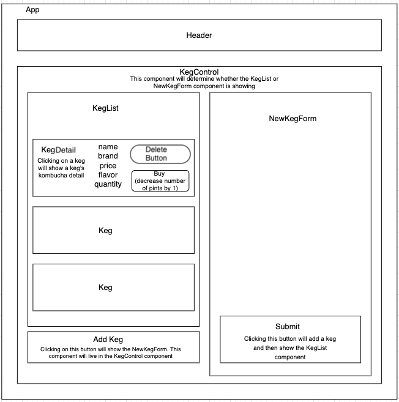

# Tap room

#### _React with Redux, 07/10/2020_

#### By _**Zinfira Safargalieva**_

## Description

_This project was bootstrapped with [Create React App](https://github.com/facebook/create-react-app). Built a tap room in React where a kombucha store can track their kegs. Redux stores all application state._


## User Stories

* A user is able to see a list/menu of all available kegs. For each keg, the user is able to see its name, brand, price and flavor.
* A user is able to submit a form to add a new keg to a list.
* A user is able to click on a keg to see its detail page.
* A user is able to see how many pints are left in a keg. A full keg has 124 pints. The pint quantity is displayed on Keg Detail page.
* A user is able to click "Buy Pint" button. This decreases the number of pints left by 1.
* A user is able to see "Out of Stock" when keg is empty (the pint quantity is 0).
* A user is able to remove a created keg from tap room.

## Component diagram




## Setup/Installation Requirements

Clone this repository via Terminal using the following commands:

* >$ cd Desktop
* >$ git clone https://github.com/Zinfira/redux_tap_room.git
* >cd redux_tap_room

Next, confirm that you navigated to the `redux_tap_room` project directory by entering ```pwd``` in Terminal.
Then, run at the project's root directory via Terminal the following commands:

* >$ npm install
* >$ npm start

This command will start the server. Open the browser(Chrome) and input __localhost:3000__

## Known Bugs

_Do not have update functionality yet._


## Support and contact details

_If you have any issues with the program or you have any suggestions, email me <zsafargalieva@gmail.com>_


## Technologies Used

_React, Redux, CSS, JavaScript, Webpack, npm, Jest


### License

*Licensed under [MIT](https://en.wikipedia.org/wiki/MIT_License) license*

Copyright (c) 2020 **_Zinfira Safargalieva_**


## Available Scripts

In the project directory, you can run:

### `npm start`

Runs the app in the development mode.<br />
Open [http://localhost:3000](http://localhost:3000) to view it in the browser.

The page will reload if you make edits.<br />
You will also see any lint errors in the console.

### `npm test`

Launches the test runner in the interactive watch mode.<br />
See the section about [running tests](https://facebook.github.io/create-react-app/docs/running-tests) for more information.

### `npm run build`

Builds the app for production to the `build` folder.<br />
It correctly bundles React in production mode and optimizes the build for the best performance.

The build is minified and the filenames include the hashes.<br />
Your app is ready to be deployed!

See the section about [deployment](https://facebook.github.io/create-react-app/docs/deployment) for more information.

### `npm run eject`

**Note: this is a one-way operation. Once you `eject`, you can’t go back!**

If you aren’t satisfied with the build tool and configuration choices, you can `eject` at any time. This command will remove the single build dependency from your project.

Instead, it will copy all the configuration files and the transitive dependencies (webpack, Babel, ESLint, etc) right into your project so you have full control over them. All of the commands except `eject` will still work, but they will point to the copied scripts so you can tweak them. At this point you’re on your own.

You don’t have to ever use `eject`. The curated feature set is suitable for small and middle deployments, and you shouldn’t feel obligated to use this feature. However we understand that this tool wouldn’t be useful if you couldn’t customize it when you are ready for it.

## Learn More

You can learn more in the [Create React App documentation](https://facebook.github.io/create-react-app/docs/getting-started).

To learn React, check out the [React documentation](https://reactjs.org/).

### Code Splitting

This section has moved here: https://facebook.github.io/create-react-app/docs/code-splitting

### Analyzing the Bundle Size

This section has moved here: https://facebook.github.io/create-react-app/docs/analyzing-the-bundle-size

### Making a Progressive Web App

This section has moved here: https://facebook.github.io/create-react-app/docs/making-a-progressive-web-app

### Advanced Configuration

This section has moved here: https://facebook.github.io/create-react-app/docs/advanced-configuration

### Deployment

This section has moved here: https://facebook.github.io/create-react-app/docs/deployment

### `npm run build` fails to minify

This section has moved here: https://facebook.github.io/create-react-app/docs/troubleshooting#npm-run-build-fails-to-minify
